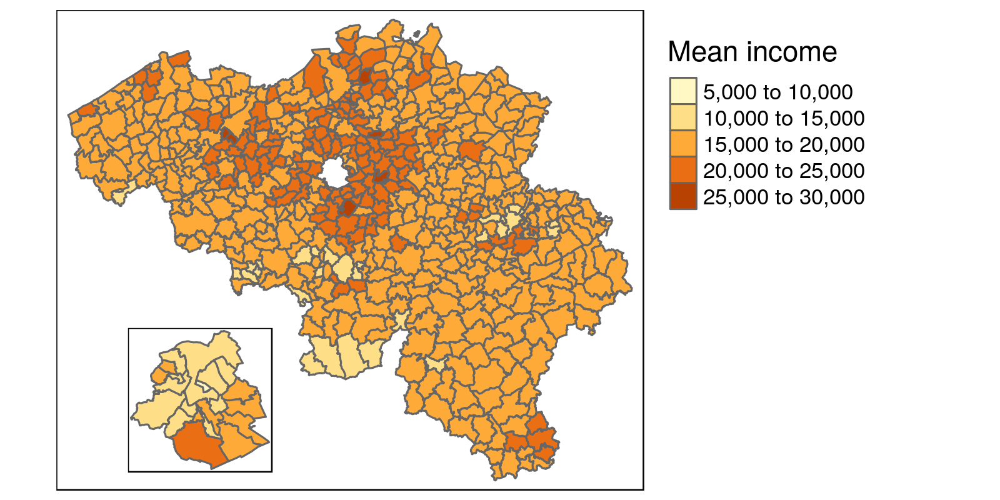

# How can I join Brussels to the rest of the provinces?

```{r, warning=FALSE, message=FALSE}
library(BelgiumMaps.StatBel)
library(sf)
library(dplyr)
library(tmap)

data("BE_ADMIN_PROVINCE")
data("BE_ADMIN_REGION")
prov <- st_as_sf(BE_ADMIN_PROVINCE)
region <- st_as_sf(BE_ADMIN_REGION)
```


The spatial data in the `BelgiumMaps.StatBel`-package on provincial level contains a hole for Brussels, as Brussels is a region not a province. 

```{r, warning=FALSE, message=FALSE}
qtm(prov)
```

We don't want to spatially join the region of Brussels to the surrounding province of Vlaams-Brabant, but want an additional spatial feature in the set of provinces, representing Brussels.

As expected with the close alignment through the `sf`-package of data operations and spatial operations, this can be achieved by stacking the two datasets with the base R function `rbind()` (row bind).

```{r, warning=FALSE, message=FALSE}
prov <- prov %>%
  # select and rename variables to have the name names for stacking
  select(niscode = CD_PROV_REFNIS, label = TX_PROV_DESCR_NL) 

prov # 10 records for 10 provinces
```


```{r, warning=FALSE, message=FALSE}
brussel <- region %>% filter(
  # select region of Brussels
  TX_RGN_DESCR_NL == 'Brussels Hoofdstedelijk Gewest') %>% 
  # select and rename variables to have the name names for stacking
  select(niscode = CD_RGN_REFNIS, label = TX_RGN_DESCR_NL)

brussel # one record for Brussels
```

```{r, warning=FALSE, message=FALSE}
prov_bxl <- rbind(prov, brussel) # combine records

prov_bxl %>% print(n=11) # 11 records: 10 provinces + region of Brussels
```

```{r, warning=FALSE, message=FALSE}
qtm(prov_bxl)
```


# How can I join Brussels as an inset-map?

Outlying locations (e.g. Alaska on US-maps) or areas-of interested that you want to zoom in on, can also be displayed with an inset map on a main map. This is also handy for Brussels, especially if you want to show details. You can do this in tmap by defining viewports using the `grid`-package, and specifing the inset map and the viewport for the inset man, when saving the map with `tmap_save().

```{r, warning=FALSE, message=FALSE}
library(readr)
# load municipal boundaries
data("BE_ADMIN_MUNTY")
munip_map <- st_as_sf(BE_ADMIN_MUNTY)

# load fiscal income data on municipal level
munip_data <- read_csv(
  file = 'data/fiscal_incomes_2016.csv', 
  col_types = cols(
    munip_label = col_character(),
    munip_nis = col_character(),
    n_inhabitants = col_integer(),
    income_mean = col_integer() ))

# add map and income data together on muncipal level
munip <- left_join(
  munip_map, munip_data, 
  by = c('CD_MUNTY_REFNIS' = 'munip_nis'))
```


```{r}
# remove Brussels municipalities for the main map (empty hole)
munip_nobxl <- munip %>% filter(TX_RGN_DESCR_NL != 'Brussels Hoofdstedelijk Gewest')

# construct main map
mainmap <- qtm(munip_nobxl, fill = 'income_mean', 
               fill.title = 'Mean income', 
               # same manual breaks in main and inset map
               fill.breaks = c(5000, 10000, 15000, 20000, 25000, 30000)) +
  tm_legend(legend.outside = TRUE, legend.outside.position="right")

mainmap
```

```{r, warning=FALSE, message=FALSE}
# select only Brussels municipalities for the inset map
munip_onlybxl <- munip %>% filter(TX_RGN_DESCR_NL == 'Brussels Hoofdstedelijk Gewest')

# construct inset map for Brussels
insetmap <- qtm(munip_onlybxl, fill = 'income_mean', 
                fill.breaks = c(5000, 10000, 15000, 20000, 25000, 30000)) + 
  tm_legend(show=FALSE) # no legend for the inset map

insetmap
```


```{r, warning=FALSE, message=FALSE}
library(grid)

# specify the location (viewport) for the inset map
viewport_bxl <- viewport(x = 0.2, y = 0.2, width = 0.3, height = 0.3)

# save map with the inset map and the viewport in addition to the main map
tmap_save(mainmap, filename = 'municipalities_income_inset_bxl.png', 
          width = 1600, height = 800, 
          insets_tm = insetmap, insets_vp = viewport_bxl)
```




# How do I format tmap legends with percentages?

You can specify detailed, custom functions to format the numbers displayed in the legend, using the `legend.format` parameter when using `tm_fill()`. The [scales package](https://scales.r-lib.org/) contains some utility functions to format numbers, for percentages we can use `percent_format()` and specify the number of digits, the decimal mark, etc.

```{r}
munip <- munip %>%
  # Contrived: calculate mean income in municipalities as percentage of total in Belgium
  mutate(income_pct = income_mean / sum(income_mean))
```

```{r, warning=FALSE, message=FALSE}
library(scales)

tm_shape(munip) +
  tm_fill(col = 'income_pct', 
          title = 'Percentage of income',
          legend.format = percent_format(accuracy = .01) ) +
  tm_borders(col = 'white', lwd = .5)
```

```{r, warning=FALSE, message=FALSE}
# further customisation
tm_shape(munip) +
  tm_fill(col = 'income_pct', 
          title = 'Percentage of income',
          legend.format = list(
            fun = percent_format(accuracy = .01, suffix = ' pct'), # 'pct' instead of '%'
            text.separator = '-' )) + # dash instead of 'to' for separator 
  tm_borders(col = 'white', lwd = .5)
```

# Can I add points to a thematic map?

Yes, in `tmap` that can be done using functions such as tm_symbols() (generic), or tm_squares(), tm_bubbles(), tm_dots(), or tm_makers().

You can do this with all records that have coordinates-data (latitude, longitude). As an example, we download the VDAB offices locations from their open data portal ([other tutorial using this data with an interactive map example](https://rawgit.com/mhermans/rgeonotebooks/master/vdab_api_popup_map/vdab_api_popup_map.nb.html)).

```{r, warning=FALSE, message=FALSE}
library(jsonlite) # used for converting the JSON data to a dataframe

# Fetch the location data from de VDAB open data portal
vdab.kantoren = fromJSON('http://opendata.vdab.be/vdab/locaties.json') %>%
  mutate_at(vars(lat, lon), as.double) # coordinates need to be numeric, not a character
```


```{r, warning=FALSE, message=FALSE}
# convert 'regular' dataframe to a sf-object
vdab.kantoren = st_as_sf(
  vdab.kantoren, 
  coords = c("lon", "lat"), # specify the columns holding the coordinates data
  crs = 4326, # specify the map projection to be the same as the map projection.
  agr = "constant")
```

Using `tm_symbols()`, we layer the office locations on a map that shows the mean income on muncipal level.

```{r, warning=FALSE, message=FALSE}
# Only offices in Flanders -> subselect map
vlaanderen <- munip %>% filter(TX_RGN_DESCR_NL == 'Vlaams Gewest')

map.vdab <- tm_shape(vlaanderen) +
  tm_fill(col = 'income_mean', title = 'Mean income', alpha = 0.4) + # fill polygons with color
  tm_borders(col = 'white', lwd = 0.6) +  # white borders between municipalities
  tm_shape(vdab.kantoren) + # add the spatial dataframle containing points
  tm_symbols(col = 'typelocatie', title.col = 'VDAB office type', size = 0.3) + # add layer with symbols/points
  tm_legend(legend.outside = TRUE, legend.outside.position="right") # position legend outside

map.vdab
```


# How to add a logo to ggplot-based map?

In ggplot, adding a logo is more generic but less intuitive then using `tm_logo()` in the `tmap`-package. But you can use the generic function `annotation_raster()` to overlay an image on a plot and achieve the same effect.

```{r, warning=FALSE, message=FALSE}
library(ggplot2)
library(scales) # optional, for formatting number

m.muni.income <- ggplot(munip) +
  geom_sf(aes(fill = income_mean), lwd = .1) + # lwd sets thin borders
  scale_fill_gradient2( # use diverging color scale around median income,
    labels = number_format(big.mark = '.'), # format numbers w/t thousands-point.
    high = '#529FD3', low = '#FB9316', # HIVA-logo colors to define ends color range.
    midpoint = median(munip$income_mean)) + 
  labs(title = 'Spatial income inequality in Belgium',
       fill = "Mean income",
       caption = 'Source: Statbel (fiscal year 2016)')

m.muni.income
```

```{r, warning=FALSE, message=FALSE}
library(png)
hiva_logo <- readPNG('data/hiva_logo_400x400.png')

# add logo in plot, specify size through coordinates on x and y-axes.
m.muni.income <- m.muni.income + 
  annotation_raster(hiva_logo, ymin = 49.5 ,ymax= 49.8, xmin = 2.5,xmax = 3)

m.muni.income
```

